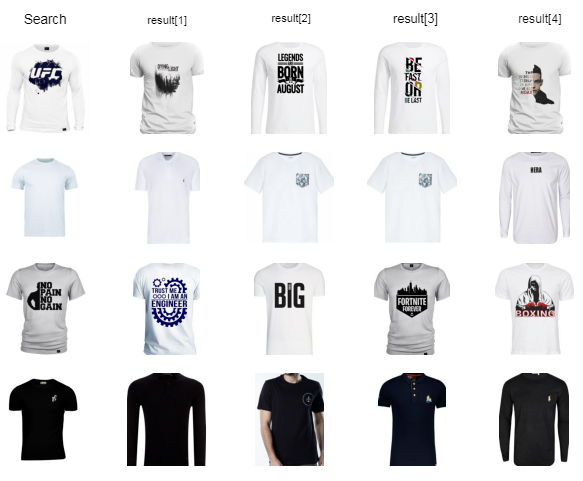

# visual-search-for-fashion

- When we mention the term ‘search’, it typically conveys finding. Counting what technology changed over the years, search serves as the very beginning of the online ecosystem that empowers billions of businesses across the internet. Primarily the main types of search forms are textual and image. And, the most common instance of visual search can be found with the world’s biggest search engine - Google. When the user enters a query, the search engine algorithm maps the textual request to available images and displays it to the user searching.
Over time, search has now been powered using AI and visual search deep learning techniques. A fair amount of machine learning involvement has gone into all forms of online search methods.

## Overview 

Just like Google image search, here we are going to build a simple Image search engine using the Deep learning model VGG16. Given a query image, we are going to display images similar to it. We are going to implement it using Keras (It is an open-source software library that provides a Python interface for artificial neural networks)

### Example :

