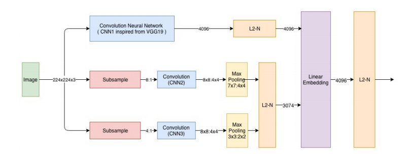
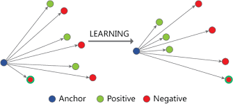
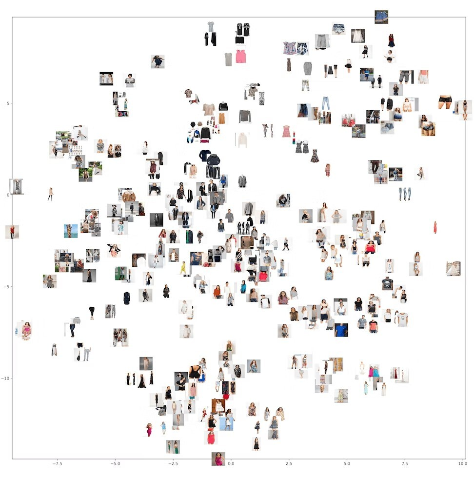

# visual-search-for-fashion

- Visual search is a process of finding items or information using images. It is a common task for users of various devices, such as computers, smartphones, and televisions. In the context of search engines, visual search is the process of ranking webpages according to how well they are able to present visual content.

- Visual search has been shown to be a powerful tool for finding information. For example, a study by Google revealed that users are 26% more likely to click on a result in a visual search if the result is relevant to the query. Additionally, a study by Visual IQ found that users are 70% more likely to click on a result in a visual

- Within the fashion industry, there is a need to be able to search for clothing items based on their visual attributes. This idea can be applied in many different ways such as finding similar clothes to an item that was recently purchased, or finding other items that look like something you own. The goal of this project is to build an end-to-end system that allows users to search via image inputs and returns relevant results based on deep learnin

## Overview 

- Just like Google image search, here we are going to build a simple Image search engine using the Deep learning model VGG16. Given a query image, we are going to display images similar to it. We are going to implement it using Keras (It is an open-source software library that provides a Python interface for artificial neural networks)

- Siamese networks are neural networks that have been trained using pairs of images to learn a similar relationship.

### Example :

## Model Architecture

-we are trying to use features extracted from an image to get(recommend) products similar to that image.In a Siamese network we basically pass 2 pair of images, one pair belongs to similar images and other ones to dissimilar. The core idea is for the model to learn weights based on similarity and dissimilarity of images. If we can capture the fine grained visual details by generating embedding using such an architecture. We can actually use these embedding to recommend similar products. The major contributions of this work would be a Siamese network consisting of a multi-scale deep CNN that learns a 4096-dimensional embedding of the image to capture the notion of visual similarity

- or this work we have used triplet data to train and validate. Triplet data consists of a query image, positive image (similar to query image) and a negative image (relatively dissimilar to query image as positive image). The query image can either be a Wild Image(where people wearing the cloth in everyday uncontrolled settings) or Catalog Image(model wearing cloth in controlled settings as shown in an eCommerce app). While the positive and negative images can be In-class(same product category as query image) or Out-of-class(other product category than query image).

### output of model 

The process of converting an image into a `vector of n-dimensions` is called dimensionality reduction, because it reduces the number of dimensions in the original data set. This allows for easier comparison between different images and also makes it easier for computers to process these images, as opposed to having millions or even billions of dimensions in each image.

After all layers have been produced from the input image, they are compared to create an output image that shows what similarities there might be between two different images (or even more than two).

## Conclusion

- With the advancements in machine learning and deep learning, we are able to do things that were unthinkable a decade ago. This project is just one example of how these technologies can be used to improve people's lives by helping them find clothes they will like more easily.

## resource

- [Siamese Network](https://www.youtube.com/watch?v=6jfw8MuKwpI&ab_channel=DeepLearningAI)
- [Siamese Networks and Similarity Learning](https://www.youtube.com/watch?v=BcF6FfZHDqA&ab_channel=DynamicVisionandLearningGroup)
- [Retrieving Similar E-Commerce Images Using Deep Learning](https://www.arxiv-vanity.com/papers/1901.03546/)
- [Similarity learning for clothing](https://towardsdatascience.com/similarity-learning-for-clothing-building-a-web-service-from-scratch-350216830e21)

