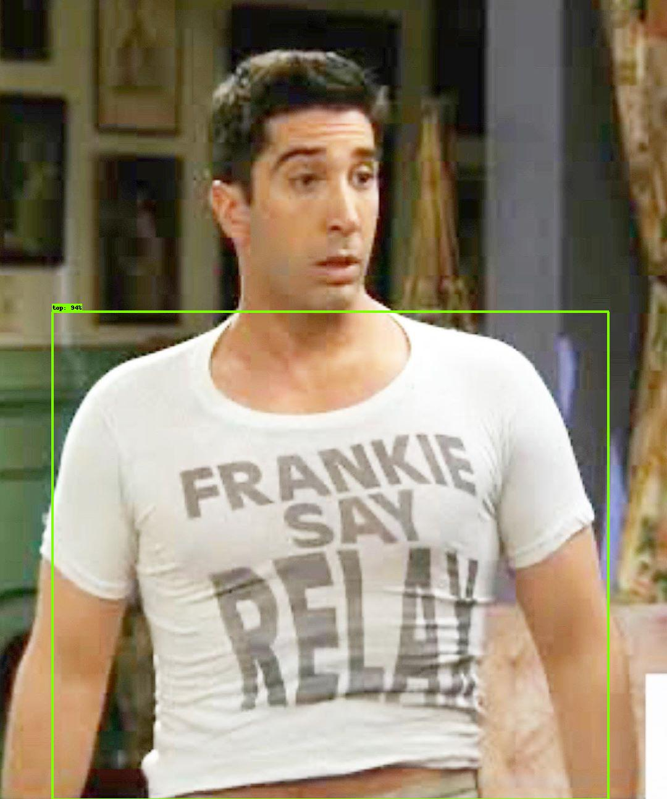
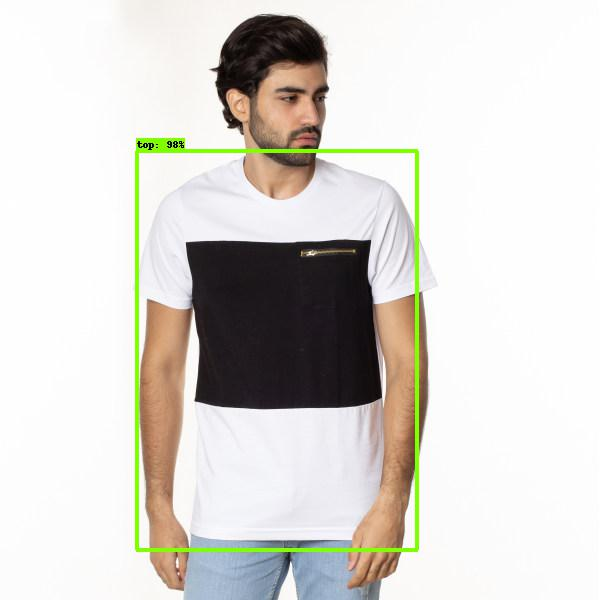
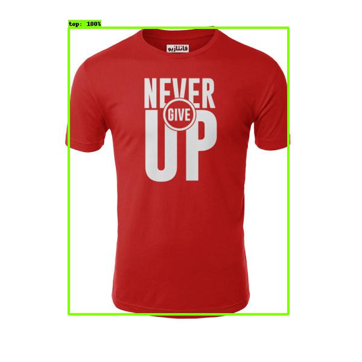

# object detection top clothing

- Object Detection using [TensorFlow-Object-Detection_API](https://github.com/tensorflow/models/blob/master/research/object_detection/g3doc/tf2_detection_zoo.md)

- Object detection allows for the recognition, detection of multiple objects within an image. It provides us a much better understanding of an image as a whole as opposed to just visual recognition.

Model name                                                                                                                                                                  | Speed (ms) | COCO mAP | Outputs
--------------------------------------------------------------------------------------------------------------------------------------------------------------------------- | :--------: | :----------: | :-----:
[EfficientDet D0 512x512](http://download.tensorflow.org/models/object_detection/tf2/20200711/efficientdet_d0_coco17_tpu-32.tar.gz)                                  | 39         | 33.6           | Boxes
[EfficientDet D1 640x640](http://download.tensorflow.org/models/object_detection/tf2/20200711/efficientdet_d1_coco17_tpu-32.tar.gz)                                  | 54         | 38.4           | Boxes
[EfficientDet D2 768x768](http://download.tensorflow.org/models/object_detection/tf2/20200711/efficientdet_d2_coco17_tpu-32.tar.gz)                                  | 67         | 41.8           | Boxes
[EfficientDet D3 896x896](http://download.tensorflow.org/models/object_detection/tf2/20200711/efficientdet_d3_coco17_tpu-32.tar.gz)                                  | 95         | 45.4           | Boxes
[EfficientDet D4 1024x1024](http://download.tensorflow.org/models/object_detection/tf2/20200711/efficientdet_d4_coco17_tpu-32.tar.gz)                              | 133         | 48.5           | Boxes
[EfficientDet D5 1280x1280](http://download.tensorflow.org/models/object_detection/tf2/20200711/efficientdet_d5_coco17_tpu-32.tar.gz)                             | 222         | 49.7           | Boxes
[EfficientDet D6 1280x1280](http://download.tensorflow.org/models/object_detection/tf2/20200711/efficientdet_d6_coco17_tpu-32.tar.gz)                             | 268         | 50.5           | Boxes
[EfficientDet D7 1536x1536](http://download.tensorflow.org/models/object_detection/tf2/20200711/efficientdet_d7_coco17_tpu-32.tar.gz)                             | 325         | 51.2           | Boxes

## Overview `Clothes Detector`

- Object detection combines classification and localization to determine what objects are in the image or video and specify where they are in the image. It applies classification to distinct objects and uses bounding boxes, as shown below.

`Deep Clothes Detector` is a clothes detection framework based on [EfficientDet D3](http://download.tensorflow.org/models/object_detection/tf2/20200711/efficientdet_d3_coco17_tpu-32.tar.gz). Given a fashion image, this software finds and localizes potential *upper-body clothes*

   

## Requirements

* **python 3.8**
* **opencv (cv2)**
* **tensorboard**
* **pycocotools**
* **efficientnet_d3**

## model segmentation

U-Net is used as our neural network architecture framework, originated in [U-Net: Convolutional Networks for Biomedical Image Segmentation](https://lmb.informatik.uni-freiburg.de/people/ronneber/u-net/). To implement transfer learning, we designed the following two models for our LUS segmentation task, V-Unet and X-Unet, inspired by two similar research on ultrasound segmentation: [Automatic detection of lumen and media in the IVUS images using U-Net with VGG16 Encoder](https://arxiv.org/pdf/1806.07554.pdf) and [Fine-Tuning U-Net for Ultrasound Image Segmentation: Different Layers, Different Outcomes](https://ieeexplore.ieee.org/document/9162061?denied=). Dice coefficient (DICE) is used as the evaluation metric. 

### V-Unet models and versions

V-Unet (U-Net with VGG16 as the encoder and further trained on LUS) has a structure shown in the following figure. VGG16, pretrained model on ImageNet is used to replace the contracting path of U-Net as a hybrid between these structures. The whole network had 28,804,545 parameters in total.

## Overview `Clothes segment`

## resource
- [Train EfficientDet in TensorFlow 2 Object Detection](https://www.youtube.com/watch?v=yJg1FX2goCo&ab_channel=Roboflow)
- [Create Dataset in Roboflow](https://www.youtube.com/watch?v=9m9GWd4hKoU&ab_channel=InabiaSolutions%26ConsultingInc)
- [Tensorflow Object Detection in 5 Hours with Python](https://www.youtube.com/watch?v=yqkISICHH-U&t=7899s&ab_channel=NicholasRenotte)
- [EfficientDet: Scalable and Efficient Object Detection](https://arxiv.org/abs/1911.09070)
- [Efficient Methods and Hardware for Deep Learning](https://stacks.stanford.edu/file/druid:qf934gh3708/EFFICIENT%20METHODS%20AND%20HARDWARE%20FOR%20DEEP%20LEARNING-augmented.pdf)
